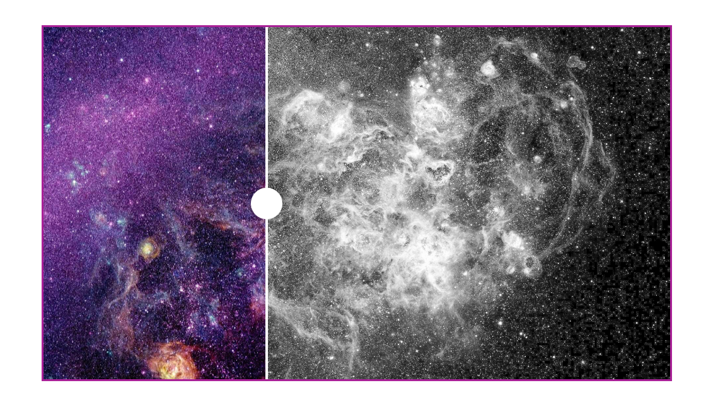

# Проект на JS до/после для фото
<<<<<<< HEAD
Простой js пример для отображение фото, с возможностью двигать бегунок для телефонов.
###Пример можно посмотреть на странице: 
[Ссылка на страницу просмотра](https://vladjutnik.github.io/js-after-before/)
###Или пример:

=======
>>>>>>> origin/main
